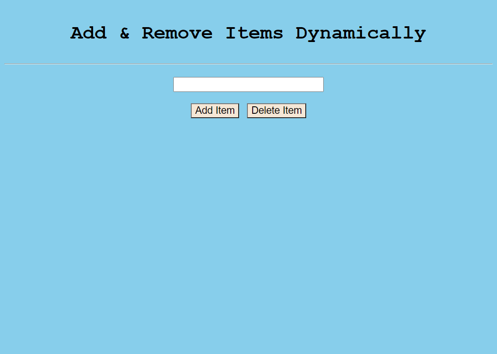
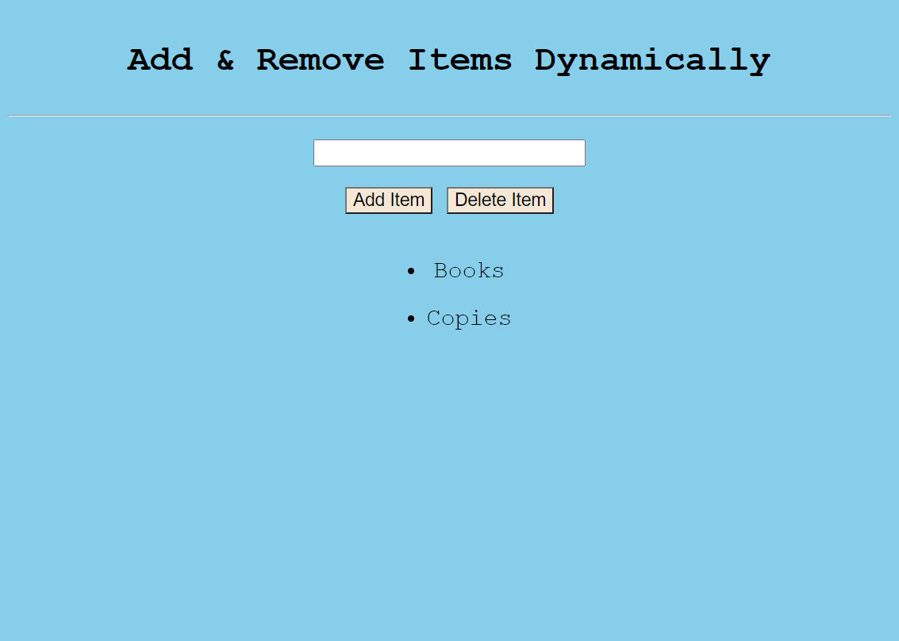

# Add-Remove-Item-Lists-Application
Through this application user can append or remove item lists dynamically and it will show to the show instantaneously.  The languages used HTML, CSS and JavaScript.

# Homepage

# Append List

